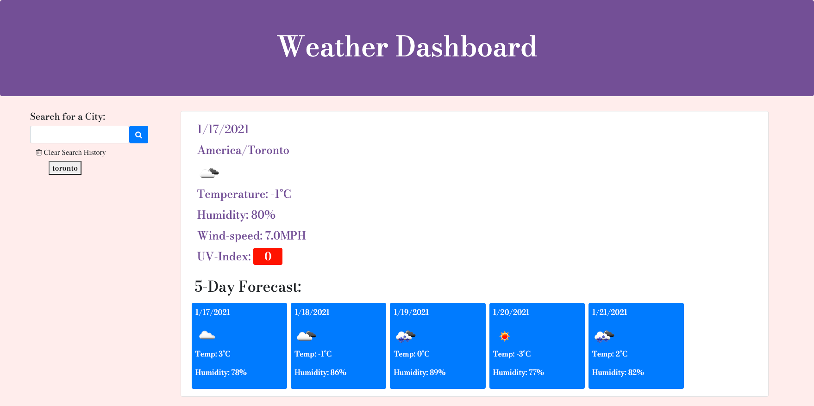
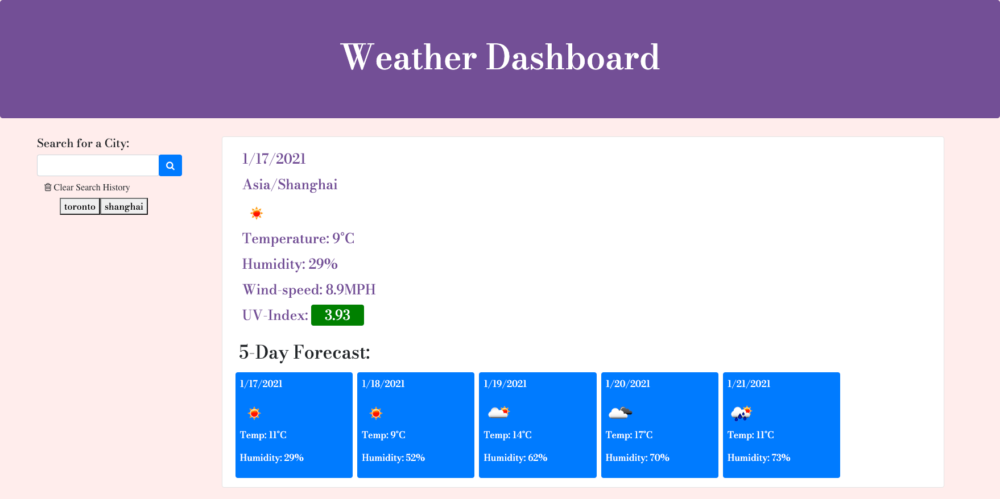
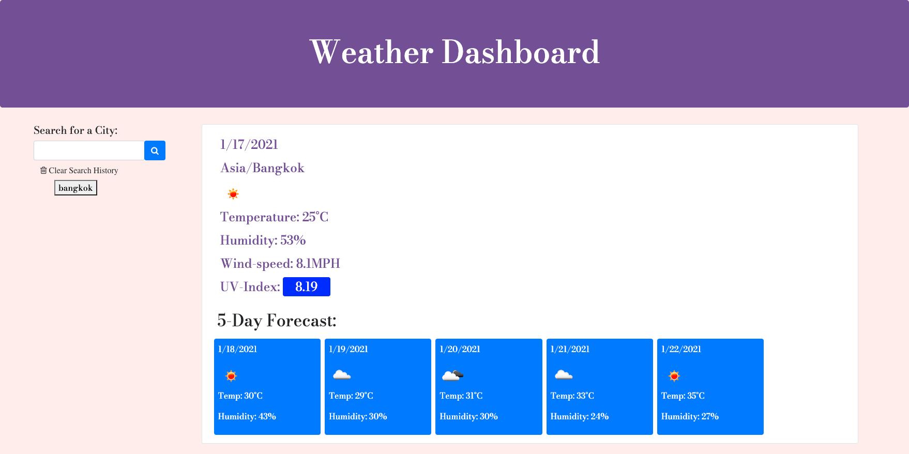

# Weather Dashboard
A weather app will run in browser, and will feature dynamically updated HTML and CSS powered by JavaScript code.

## Code style
HTML
CSS
JAVA SCRIPT

# Built with
The user arrives at the landing page and is presented with a weather app. 
Also note the search input to capture the current weather of a city.

Clicking the search button presents the user with a current weather conditions for that city
with the city name, the date, an icon representation of weather conditions, the temperature, 
the humidity, the wind speed, and the UV index.

Also future weather conditions for that city is listed below,presented with a 5-day forecast that 
displays the date, an icon representation of weather conditions, the temperature, and the humidity.

Aside, presented with current and future conditions for that city.

## Screenshots

# Link to Webpage
[Weather Dashboard](https://neeko623.github.io/Weather-Dashboard/)